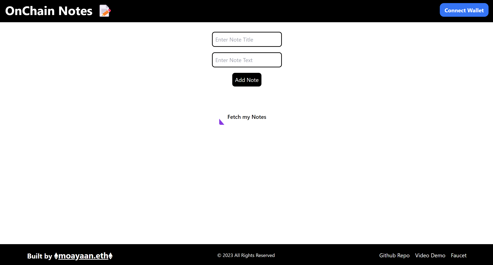
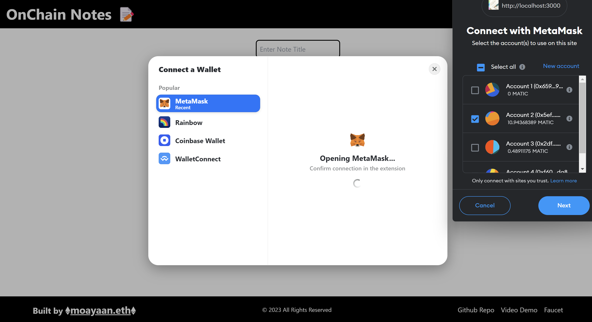
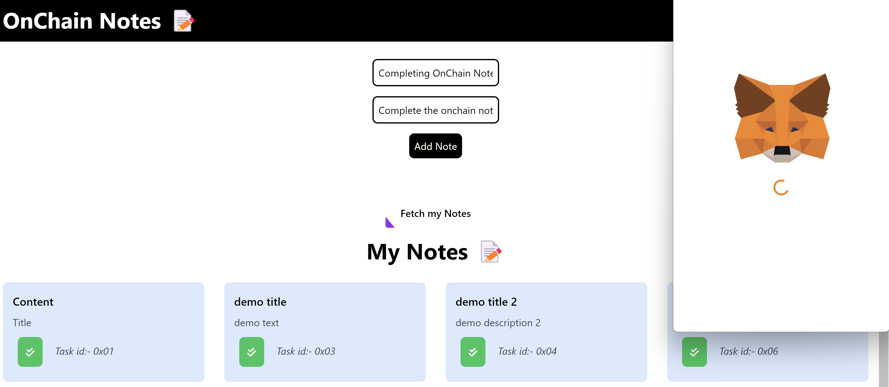
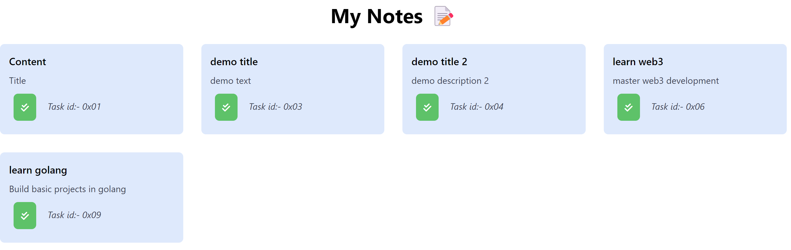
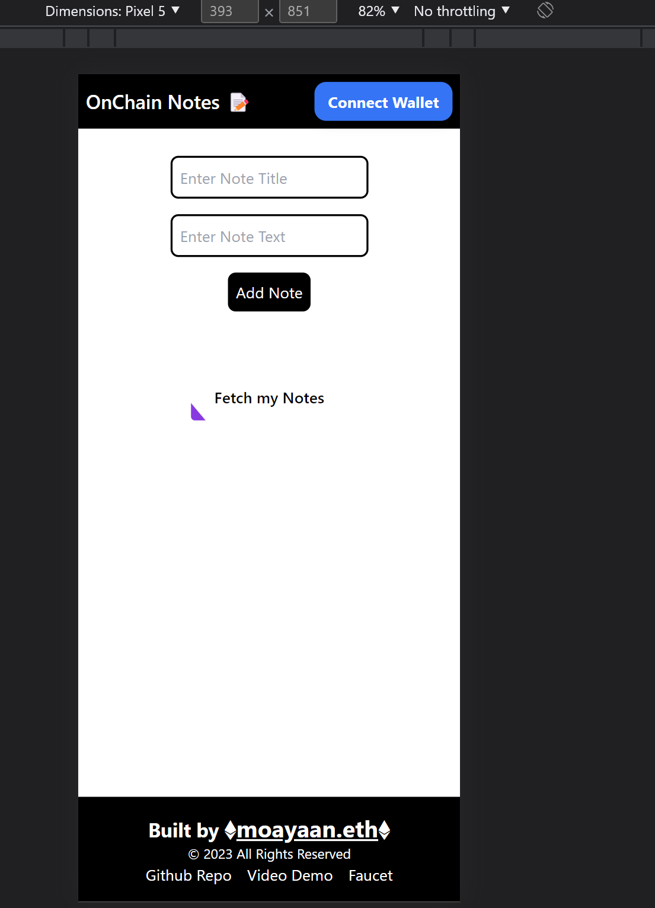

# OnChain Notes
OnChain notes is a web3 notes web app using which you can store your notes directly on Polygon Blockchain.

Live Link:- 

# Video Demo
<video src="public/.mp4" controls="controls" style="max-width: 730px;"> </video>

# Screenshots







# Tech Stack
The Website uses:-
- [Rainbowkit](https://www.npmjs.com/package/@rainbow-me/rainbowkit) v0.12.0 for **Connecting to Account** 
- [dotenv](https://www.npmjs.com/package/dotenv) v16.0.3 **for storing Env Variables**
- [Next.js](https://nextjs.org/) v13.2.4 **For Front-End Development of Components**
- [wagmi](https://www.npmjs.com/package/wagmi) v0.12.1 **For Interacting with Smart Contract**
- [chai](https://www.npmjs.com/package/chai) v4.2. **For Testing the Smart Contract**
- [hardhat](https://www.npmjs.com/package/hardhat) **For Deployment and Testing of Smart Contract**
- [tailwindcss](https://www.npmjs.com/package/tailwindcss) **For Styling**

## Project Dependencies

This project has the following dependencies:
- [Rainbowkit](https://www.npmjs.com/package/@rainbow-me/rainbowkit) v0.12.0
- [dotenv](https://www.npmjs.com/package/dotenv) v16.0.3
- [Next.js](https://nextjs.org/) v13.2.4
- [React](https://reactjs.org/) v18.2.0
- [React DOM](https://reactjs.org/docs/react-dom.html) v18.2.0
- [wagmi](https://www.npmjs.com/package/wagmi) v0.12.1

It also has the following devDependencies:
- [@ethersproject/abi](https://www.npmjs.com/package/@ethersproject/abi) v5.4.7
- [@ethersproject/providers](https://www.npmjs.com/package/@ethersproject/providers) v5.4.7
- [@nomicfoundation/hardhat-chai-matchers](https://www.npmjs.com/package/@nomicfoundation/hardhat-chai-matchers) v1.0.0
- [@nomicfoundation/hardhat-network-helpers](https://www.npmjs.com/package/@nomicfoundation/hardhat-network-helpers) v1.0.0
- [@nomicfoundation/hardhat-toolbox](https://www.npmjs.com/package/@nomicfoundation/hardhat-toolbox) v2.0.0
- [@nomiclabs/hardhat-ethers](https://www.npmjs.com/package/@nomiclabs/hardhat-ethers) v2.0.0
- [@nomiclabs/hardhat-etherscan](https://www.npmjs.com/package/@nomiclabs/hardhat-etherscan) v3.0.0
- [@typechain/ethers-v5](https://www.npmjs.com/package/@typechain/ethers-v5) v10.1.0
- [@typechain/hardhat](https://www.npmjs.com/package/@typechain/hardhat) v6.1.2
- [autoprefixer](https://www.npmjs.com/package/autoprefixer) v10.4.14
- [chai](https://www.npmjs.com/package/chai) v4.2.0
- [eslint](https://www.npmjs.com/package/eslint) v8.35.0
- [eslint-config-next](https://www.npmjs.com/package/eslint-config-next) v13.2.4
- [ethers](https://www.npmjs.com/package/ethers) v5.7.2
- [hardhat](https://www.npmjs.com/package/hardhat) v2.11.1
- [hardhat-gas-reporter](https://www.npmjs.com/package/hardhat-gas-reporter) v1.0.8
- [postcss](https://www.npmjs.com/package/postcss) v8.4.21
- [solidity-coverage](https://www.npmjs.com/package/solidity-coverage) v0.8.0
- [tailwindcss](https://www.npmjs.com/package/tailwindcss) v3.2.7
- [typechain](https://www.npmjs.com/package/typechain) v8.1.0

......

## How to Run on Local Machine

1. To install these dependencies, run:
```bash
npm install
```
or 
```bash
yarn
```
2. Create an .env file and fill with .env.example entries
3. Type this command to run
```bash
yarn dev
```
or 
```bash
npm run dev
```
4. Open http://localhost:3000 with your browser to see the result.

# About the Developer

Hello everyone, myself **Mohammad Ayaan Siddiqui** from India. I am a Full Stack WEB3 developer and a **DECENTRALIZATION MAXI**. I talk about WEB3, Cryptocurrencies, Javascript and Python and currently learning web3.

**Currently Learning and Building in React.js, Next.js, Solidity, Golang, Hardhat, Ethers.js, React Native, Tailwind, Html, CSS, Python, etc.**

<p align="center">

</p>

If you are interested in either of the topics or building in similar skills, connect with me below:-

1.  [My Linktree with ALL SOCIALS](https://linktr.ee/ayaaneth)

2. ![Alt text] (public/hashnode.png "hashnode") [My hashnode](https://moayaan.hashnode.dev/)

3.  [Connect on Github](https://github.com/moayaan1911)

4.  [Connect on Linkedin](www.linkedin.com/in/ayaaneth)

5.  [Connect on Twitter](https://www.twitter.com/usdisshitcoin)

6.  [Connect on Telegram](https://t.me/usdisshitcoin)

7.  [Connect on dev.to](https://dev.to/moayaan1911)